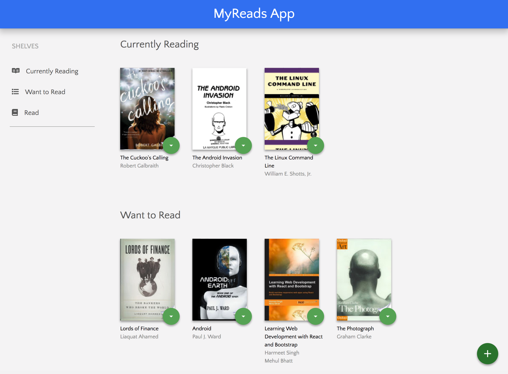
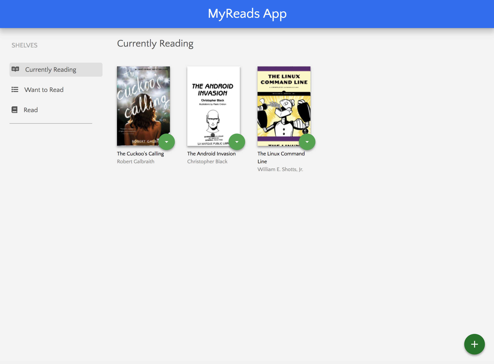
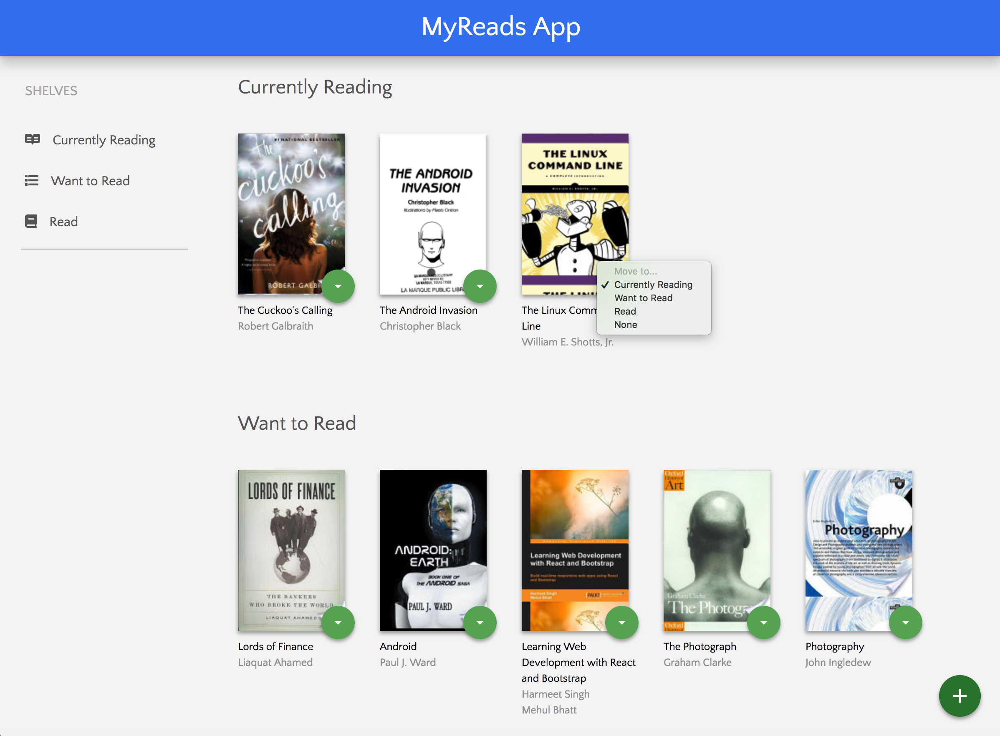
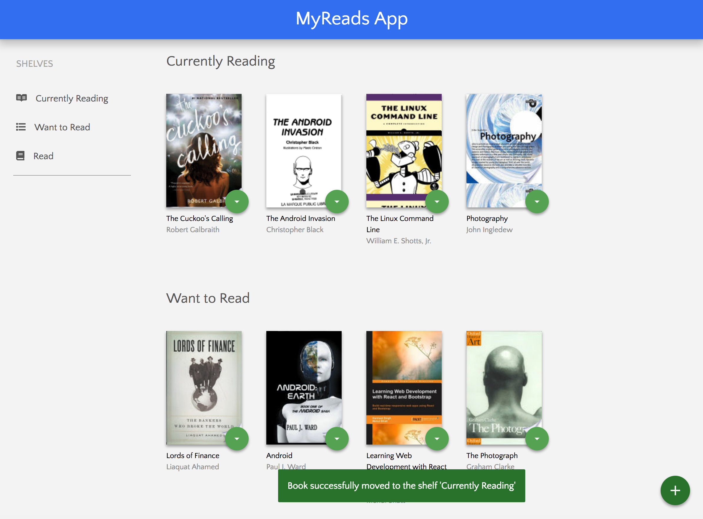
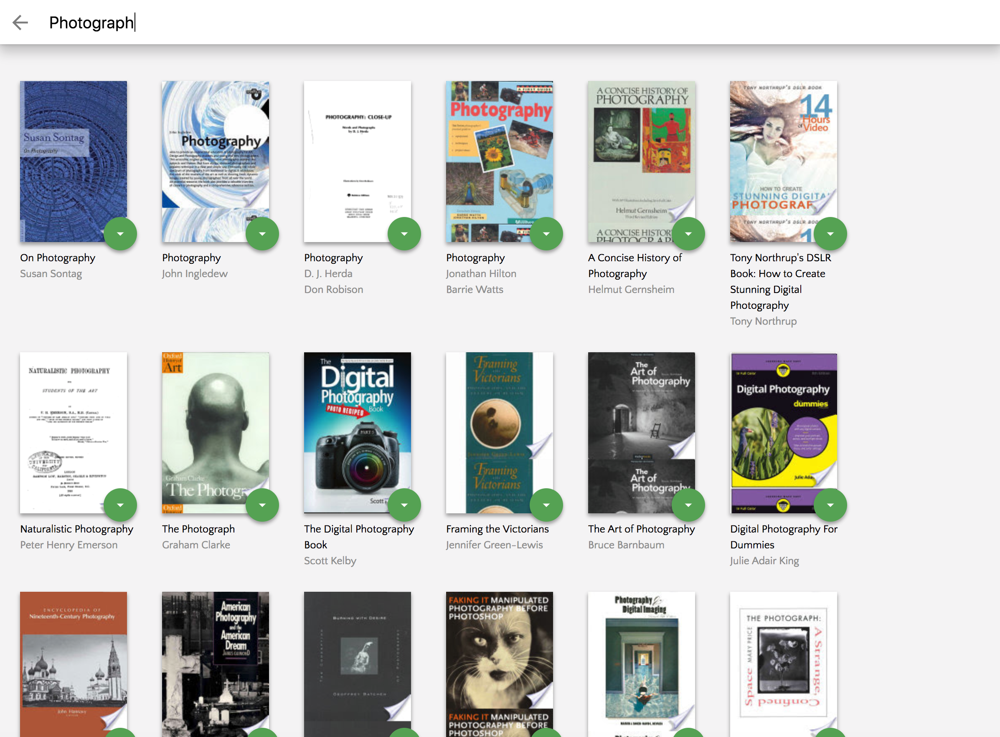

# MyReads

MyReads is a bookshelf app that allows you to select and categorize books you have read, are currently reading, or want to read. It uses a BookAPI provided by Udacity so when searching for books the result set may be limited. 

This project was bootstrapped with [Create React App](https://github.com/facebookincubator/create-react-app).

# App Functionality

In this application, the main page displays a list of "shelves" (i.e. categories), each of which contains a number of books. The three shelves are:

- Currently Reading
- Want to Read
- Read

It's possible to filter out the shelves being displayed by clicking on the shelf name on the SHELVES menu. 

Each book has a control that lets you select the shelf for that book. When you select a different shelf, the book moves there. 

The main page also has a link to /search, a search page that allows you to find books to add to your library.

The search page has a text input that may be used to find books. As the value of the text input changes, the books that match that query are displayed on the page, along with a control that lets you add the book to your library.

Below you will find some information on how to perform common tasks. 
You can find the most recent version of this guide [here](https://github.com/facebookincubator/create-react-app/blob/master/packages/react-scripts/template/README.md).

## Table of Contents

- [Getting Started](#getting-started)
  - [npm start](#npm-start)
  - [npm test](#npm-test)
  - [npm run build](#npm-run-build)  

## Getting Started

In the project directory, you can run:

### `npm start`

Runs the app in the development mode. 
Open [http://localhost:3000](http://localhost:3000) to view it in the browser.

The page will reload if you make edits. 
You will also see any lint errors in the console.

### `npm test`

Launches the test runner in the interactive watch mode. 

### `npm run build`

Builds the app for production to the `build` folder. 
It correctly bundles React in production mode and optimizes the build for the best performance.

The build is minified and the filenames include the hashes. 
Your app is ready to be deployed!